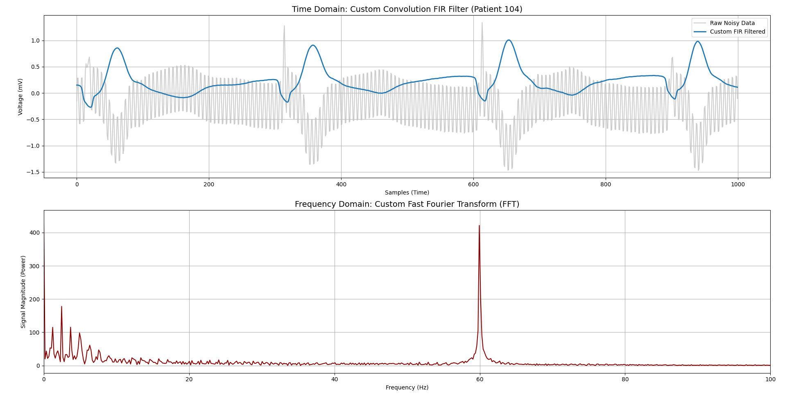
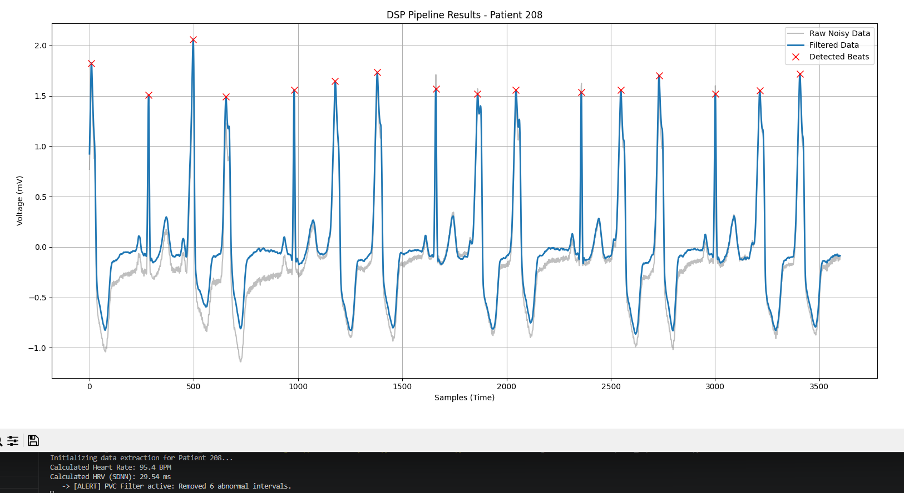

# DSP Pipeline for ECG Analysis (MIT-BIH)

A pure-software Digital Signal Processing (DSP) pipeline written in Python to clean biometric ECG data, extract BPM, and filter out Premature Ventricular Contractions (PVCs) for accurate Heart Rate Variability (HRV) calculations. 

I built this project to deeply understand the underlying math behind pre-built libraries like SciPy, translating theoretical continuous mathematics into discrete Python algorithms.

## Key Features

* **Multi-Layer Anomaly Defense:** Built a four-stage filtering system (Frequency, Polarity, Amplitude, and Temporal). It dynamically scrubs baseline wander, automatically flips inverted hospital cables, and uses a statistical median time-filter to catch and drop PVCs from the final HRV metric.
* **Custom FIR Convolution Filter:** Instead of relying entirely on `scipy.signal`, I implemented a from-scratch moving-average sliding window using mathematical convolution. This allowed me to physically isolate and observe phase delay.
* **From-Scratch Fast Fourier Transform (FFT):** To isolate 60Hz hospital powerline interference, I wrote a recursive Radix-2 Cooley-Tukey FFT algorithm to convert the time-domain data into the frequency domain.

## Visualizing the Math

**1. Frequency Domain Analysis (Custom FFT)**

*Running the custom Cooley-Tukey FFT to separate human biological frequencies (1-10Hz) from injected background static.*

**2. Time-Domain Arrhythmia Filtering**

*The pipeline catching and removing irregular PVCs using boolean masking, protecting the final SDNN calculation.*

## How to Run Locally
1. Clone the repository.
2. Install the required dependencies: `numpy`, `scipy`, `pandas`, and `matplotlib`.
3. The dataset requires the `wfdb` library to read the MIT-BIH tapes.
4. Run `main.py`. You can toggle between a single-patient deep dive or a full 48-patient batch run using the Master Control variables at the top of the file.
